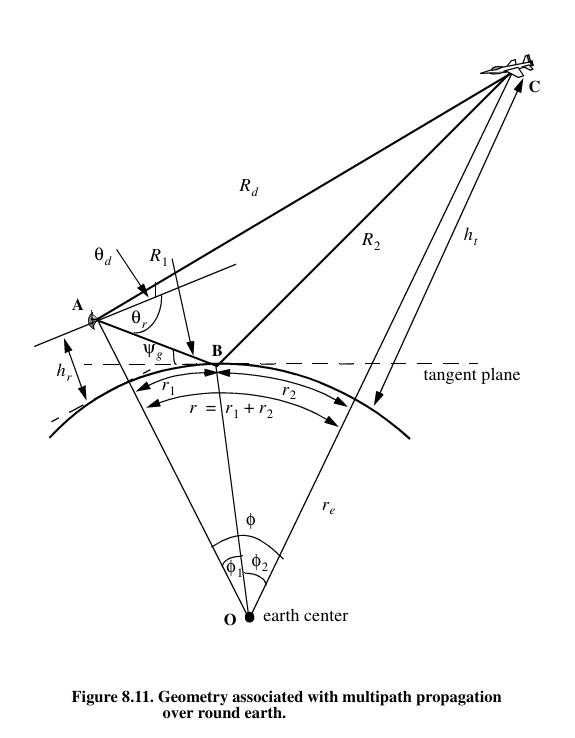

## Temat nr. 5:
Opracować arkusz kalkulacyjny wyznaczający straty propagacyjne w swobodnej 
przestrzeni oraz nad kulistą Ziemią przy użyciu modelu dwupromieniowego, gdy 
jednym z obiektów jest wysoko latający bezosobowy obiekt UAV (dron).  

- Opisać model dla wolnej przestrzeni oraz model dla kulistej Ziemi o wsp. odbicia
- Opracować arkusz kalkulacyjny ze szczegółowym opisem wprowadzanych danych, 
wykresów, jednostek,  
- Wyznaczyć przebieg strat propagacyjnych dla drona wykonującego przelot na 
wysokościach 50, 500 i 1000m w odległości do 10 km dla ziemi doskonale 
przewodzącej i o właściwościach typowego gruntu.

## Schemat poglądowy:

## Dane wejściowe:
- Częstotliwość f [MHz]
- Wysokość anteny nadawczej h_tx [m]
- Wysokość anteny odbiorczej - drona h_rx [m] - max do 1 km
- Odległość między nadajnikiem a odbiornikiem [m] - max do 10 km

## Dane Wyjściowe:

- Straty propagacyjne modelu F